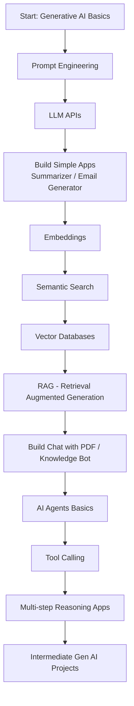

# 🚀 Gen AI Beginner Projects

Welcome to **Gen AI Beginner Projects**👋 - a hands-on learning repository designed to help you understand the fundamentals of **Generative AI** by building real-world projects using Python and modern LLMs.

This repository focuses on practical implementation of concepts like:

- Prompt Engineering
- LLM APIs (like OpenAI API)
- Embeddings
- Vector Databases
- RAG (Retrieval-Augmented Generation)
- AI Agents

Instead of just learning theory, this repo emphasizes **learning by building**.

If you’ve ever wondered:
- How does ChatGPT actually work?
- How can I build my own AI-powered app?
- How do companies use Generative AI in real products?

This repository is the practical answer to those questions.

## 🎯 Purpose of This Repository
This repository contains **small, focused Gen AI projects**, each living in its own folder, designed to:
- 📌 To build strong foundational knowledge in Generative AI
- 🛠️ To create practical, portfolio-ready projects
- 📚 To document experiments and learnings
- 🚀 To transition from beginner to intermediate level in Gen AI
- 💼 To prepare for AI/ML/LLM-based roles
- 🧠 To build intuition before production-grade systems

Each project is intentionally designed to focus on one or two core concepts to avoid overwhelming complexity.

⚠️ This repo is **not production-ready**. 

## 🧠 What You’ll Learn from This Repo

By going through these projects, you will learn:

- Prompt Engineering
  - Zero Shot, Few Shot, Chain-of-Thought Prompting
  - System vs User Prompts
  - Temperature, Top-p tuning
  - Output Structuring (JSON, Markdown)
- Working with LLM APIs
  - Making API calls
  - Handling tokens & rate limits
  - Streaming response
  - Error Handling
- Embeddings & Semantic Search
  - What embeddings are
  - Converting text -> vectors
  - Cosine similarity
  - Semantic retrieval 
- Vector Databases
  - Indexing embeddings
  - Storing & quering vectors
  - Similarity search
- RAG (Retrieval-Agumented Generation)
  - Chunking strategies
  - Context injections
  - Reducing hallucinations
  - Knowledge-grounded response
- AI Agents
  - Tool usage
  - Task planning
  - Multi-step reasoning
  - Basic agent workflows

## 🚀 Who Should Use This Repo?
This repository is perfect for:

- 🧑‍🎓 Students learning Generative AI
- 👨‍💻 Developers transitioning into AI
- 🔄 Professionals switching to AI/ML roles
- 🚀 Anyone who wants to build an AI portfolio
- 🧠 Curious minds who want to understand how modern AI works

If you are at beginner level and want structured, practical learning — this repo is for you.

## Generative AI Learning Roadmap

## 📂 Repository Structure

```text
gen-ai-beginner-projects/
│
├── ai-text-summarizer-gemini-python/
│   ├── gemini-text-summarizer.py
│   ├── READEME.md
│
├── ai-email-writer-gemini-python/
│   ├── gemini-email-writer.py
│   ├── READEME.md
│   
├── ...
│
├── requirements.txt
├── .env.example
├── .gitignore
└── README.md
```

## 🛠 Tech Stack
Common stack used across experiments:
- **Language:** Python 3.10+
- **LLMs:** Google Gemini
- **Frameworks:** langchain
- **Env Management:** python-dotenv
- **IDE:** VS Code (recommended)

## ⚙️ Environment Setup (One-Time)

### Step 1: Clone the Repository
```bash
git clone https://github.com/pankaj-kaushik/gen-ai-beginner-projects.git
cd gen-ai-beginner-projects
```
### Step 2: Create a Virtual Environment
```bash
python -m venv .venv
```
Activate it:

**Windows (PowerShell):**
```bash
.venv\Scripts\Activate.ps1
```

**Mac/Linux:**
```bash
source .venv/bin/activate
```
### Step 3: Setup Environment Variables
Create a .env file at the root
```text
GEMINI_API_KEY="your_api_key_here"
OPENAI_API_KEY="your_api_key_here"
```
👉 Refer to ```.env.example```\
👉 **Never commit** ```.env``` **to GitHub**

### Step 4: Install python libraries
```bash
pip install -r requirements.text
```

## ▶️ How to Run A Project
Each project follows the same basic flow.

### Step 1: Move into the project folder
```bash
cd ai-text-summarizer-gemini-python
```
### Step 2: Run the python application
```bash
python gemini-text-summarizer.py
```
## 🧪 How to Add a New Project
Follow this standard structure:

```text
project-name/
├── app.py
├── requirements.txt (if any)
├── README.md
└── assets/ (optional)
```
⚠️ Use similar file/folder naming convention

Best practices:
- Focus on one GenAI concept
- Keep code minimal & readable
- Document:
  - what the experiment does
  - what you will learn
  - how to run it

## 🧭 Planned / Example Experiments
Some experiments you may find or add
- Study Buddy / Concept Explainer
- Email / Message Writer
- Chat with PDF
- Resume Analyzer
- Prompt Comparison Lab
- Embeddings Search Demo
- RAG (Retrieval Augmented Generation)
- Simple AI Agent
- Interview Question Generator
- Career Coach For S/W Engineers
- Bug Root Cause Analyzer
- Teacher for kids (Math/Logic)


## ⚠️ Disclaimer
- LLM APIs may incur cost
- Outputs may vary due to model randomness
- This repo is for learning & experimentation only

## 🙌 Acknowledgements
- Google Gemini LLM
- Open-source Python community

## Contributing
💡 If you found this helpful...
- ⭐ Star the repo
- 🍴 Fork it
- 🚀 Build on top of it & submit pull request
- 📢 Share your AI story platform

**Happy Hacking 🧪🚀**